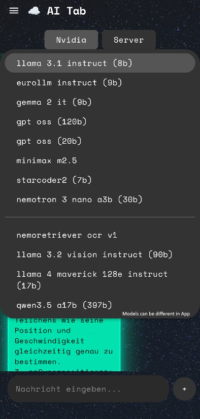
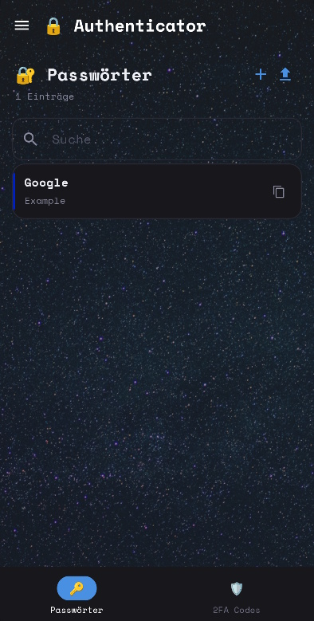
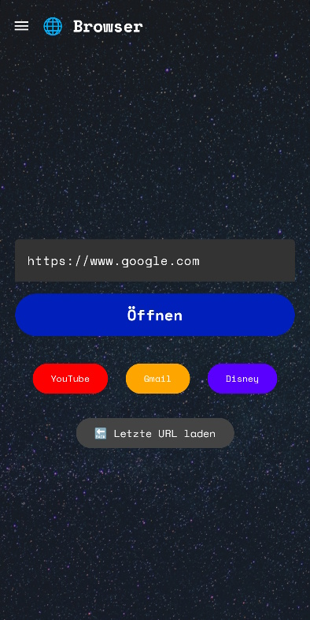
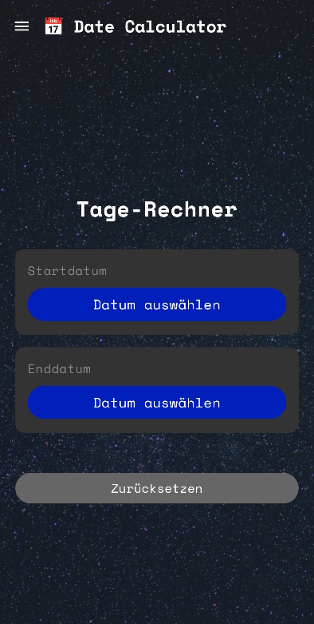
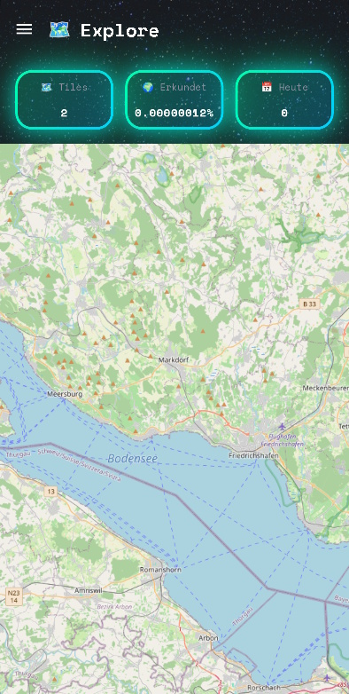
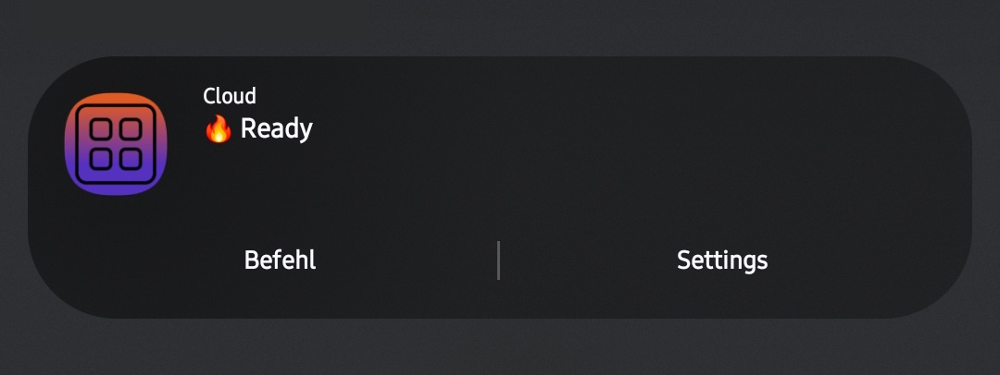

# Tabslify (Android App)

> [!IMPORTANT]
> Public Version almost finished...
>
> 5:04 AM · 6/01/2026

> [!TIP]
> Tabslify is compatible with Samsung OneUI 8.5  
> 9:11 PM · 5/19/2026

This project is a powerful, multi-functional Android application with **ONE** goal: **Replacing** and **improving** third-party apps with a **single** app — **no tracking** (optional tracking for the Music Player for AI analysis, disabled by default), **optional server binding**, and **enhanced privacy**!

## Tabs 

### Ai Tab
- **Text & Picture**: Chat with Nvidia AI models with chat context

### Audio Recorder
- **Voice:** Record your voice
- **Media:** Record Sounds which played on your phone

### Authenticator
- **2FA authenticator:** Generate and save TOTP Codes
- **Passwort Storage:** Save credentials with lots of parameters
- **Autofill:** Simply fill your Credentials in

### Browser
- **Well configured webview:** Max optimized webview for best user experience
- **Quick Link Buttons:** Set up Quick Link Buttons for maximal flow

### Date Calculator
- **Calculate Day Differences:** Select start & end date to view days between them

### Explore
- **Optional Tracking Feature** View your procent of visited world

### Movie Discover
- Discover tousands of Movies in different Genres from TMDP (The Movie Data Base)

### Gallery
- Watch & Delete Pictures and Videos from your local Storage

### Calender
- Plan tasks for an organized day

### Contacts
- Manage Contacts in one place

### Media Player
- Play, sort and manage music & podcasts locally
- Download podcasts by name and mark them as favourites

### Notes
- Take notes and mark them with a color

### Quick Access
- Get informations about Network, Display, Battery and your device
- Get an Diagram of your battery history

### Vocabs
- **AI OCR:** Upload an Image and get strucutred Vocabs
- **Learn:** Go trough your Vocabs, choose if you knew it and repeat mistakes

### Weather
- View Weather for your current location
- **Clean GUI:** Swipe trough the Tab with many animations!

## Pictures
<table>
    <tr>
        <td style="vertical-align: top; padding-right: 16px;">
            
        </td>
        <td style="vertical-align: top; padding-right: 16px;">
            
        </td>
        <td style="vertical-align: top; padding-right: 16px;">
            
        </td>
    </tr>
    <tr>
        <td style="vertical-align: top; padding-right: 16px;">
            
        </td>
        <td style="vertical-align: top; padding-right: 16px;">
            
        </td>
    </tr>
</table>

## Services
### Media Player
- Play Songs or Podcasts, of course with position saving
- Podcast AutoStop after 20min
- Podcast Queue
- **Optional Tracking for AI Analysis**

### Quiet Hours (Biggest part of app)
<table>
  <tr>
    <td style="vertical-align: top; padding-right: 16px;">
      <ul>
        <li><strong>MASSIVE Command System:</strong> Run commands via notification, like managing todos or replying to Messages from WhatsApp / Telegram, View your Gallery, and MUCH more</li>
      </ul>
    </td>
    <td style="vertical-align: top;">
      
    </td>
  </tr>
</table>

---

## Contact / Support
If you want to discuss features or contribute, feel free toopen an issue.
